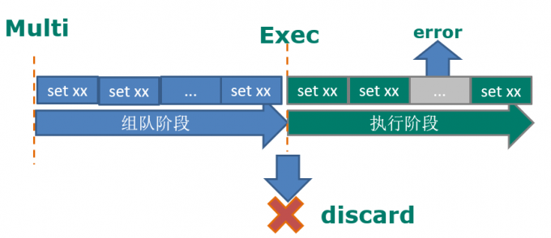
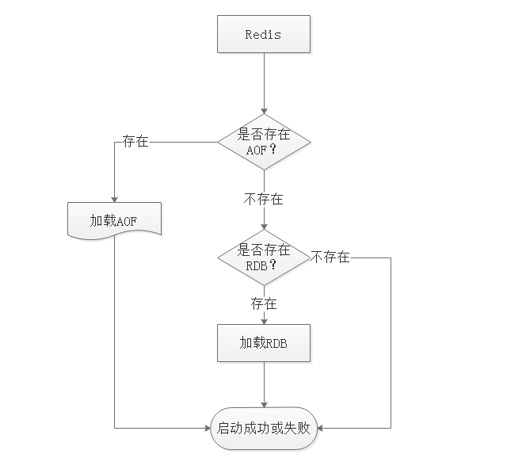
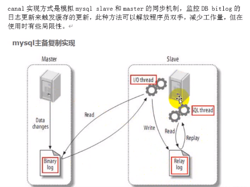
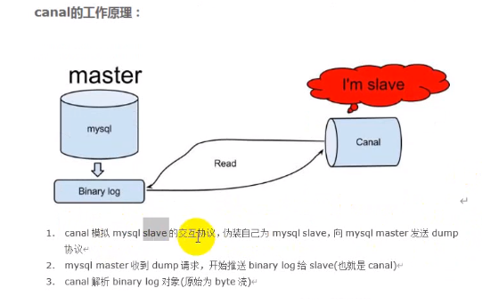
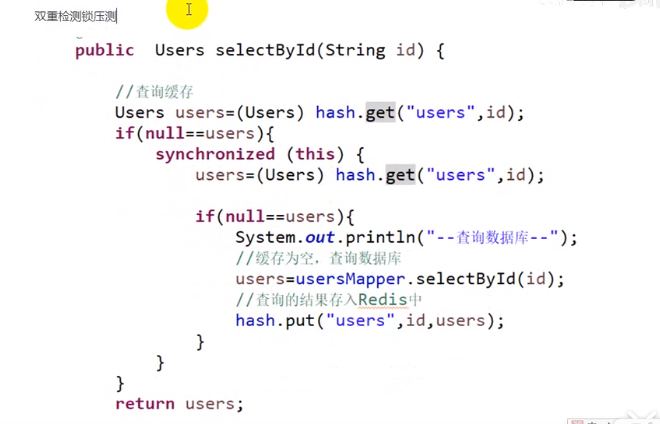

---

title: Redis 学习
categories: 后端   
tags:

  - redis
  - nosql

---


### List 数据类型

#### 简介

​	List 类型是一个链表解构的集合，其中主要有 push、pop、获取元素等，更详细的说，list类型是一个双端链表的节后，我们可以通过相关的操作井陉集合的头部或者尾部添加和删除元素，list 的设计非常简单精巧，既可以作为栈、也可以作为队列使用。

> 按照插入顺序排序，你可以添加一个元素到列表的头部（左边）或者链表的尾部（右边）。一个列表最多包含   2^32 -1 个元素

#### 常用命令

##### 赋值

``` 
lpush key value1 [values ...] : 将一个或者多个值插入到列表头部（左侧）
rpush key value1 [values ...] : 将一个或者多个值插入到列表尾部（右侧）
lpushx key value : 将一个值插入到已经存在的列表头部，如果列表不存在 操作无效
rpushx key value : 将一个值插入到已经存在的列表尾部，如果列表不存在 操作无效
```

##### 取值

```
llen key : 获取列表长度
lindex key index 通过索引获取列表的元素
lrange key start end 获取李彪指定范围的元素 lrange list_key 0 -1
```

> 描述：返回列表中指定区间的元素，区间以偏移量 start end 决定。
>
> 也可使用负数 -1 代表列表的最后一个元素，-2 代表列表的倒数第二个元素 ，以此类推。

##### 删除

```
lpop list_key 左侧删除
rpop list_key 右侧删除

堵塞的弹出
blpop list_key [keys ...] timeout 移除并且获取列表的第一个元素，如果列表没有数据，并且堵塞列表，知道列表中有数据，并且弹出元素为止，超时返回 nil
brpop list_key [keys ...] timeout

ltrim key start end 对一个列表进行 裁剪 留下 [start,end] 的数据
```

##### 修改

```
lset key index value : 修改某一列表的下标为 index 的值
linsert key bafore|after word value 在某一列表值为 word 之前或者之后插入 value 值 
```

##### 其他

```
rpoplpush l1_key l2_key 将 l1 弹出的数据 插入到 l2 列表中
rpoplpush l1 l1
```

#### 应用场景

**项目常用于：1、对数据量大的集合数据删减 2、任务队列**

**1、对数据量大的集合数据删减**

列表数据显示、关注列表、粉丝列表、留言评价等 分页、热点新闻（TOP5）等

利用 `lrange` 可以方便的实现分页功能。

2、任务列表


## Redis 多数据库

在 redis 中，数据库是由一个整数索引标识，而不是数据库名称，默认情况下  数据库连接0

**database 16 // (0 - 15)**

**select 0 // 进行切换**

移动数据到某一个数据库中

```
move key 数据库
```

数据库清空

```
flushdb 当前数据库
flushall 所有数据库
```


## Redis 事务

redis 事务可以一次执行多个命令，按顺序的串行化执行，执行中不会被其他命令所影响。

### 简介

> 批量操作在 wxec 命令前被放入队列缓存中

1. **Redis 会将一个事务中的所有命令序列化，按顺序执行**
2. **执行中不会被其他命令插入，不许出现加塞行为**
3. **不支持事务回滚**

### 常见命令

```
discard
	: 取消事务，放弃执行事务块内的所以命令
exec
	: 执行所有事务块内的命令
multi
	: 标记一个事务块的开始
unwatch
	: 取消 watch 命令对所有 key 的监视
watch key [keys ...] 
	: 监视一个或者多个key，如果事务执行之前被其他命令所改动，事务被打断
```

一个事务从开始到执行的三个阶段

- 开始事务 multi 
- 命令序列化，入队
- 执行事务 exec



### 实例1 multi exec

转账功能，A 向 B 转账 50 块钱

```shell
# 开启事务
127.0.0.1:6379> multi 
OK
127.0.0.1:6379> get account:a
QUEUED
127.0.0.1:6379> get account:b
QUEUED
127.0.0.1:6379> decrby account:a 50
QUEUED
127.0.0.1:6379> incrby account:b 50
QUEUED
# exec:执行事务;  discard:取消事务
127.0.0.1:6379> exec
1) "100"
2) "100"
3) (integer) 50
4) (integer) 150
```


### 实例3 事务的错误处理

**事务的错误处理：** 

如果执行的某个命令报出错误，则只有报错的命令不会执行，其他命令正常执行，`且不会回滚`

```shell
127.0.0.1:6379> MULTI
OK
127.0.0.1:6379> set lijian lijian
QUEUED
127.0.0.1:6379> get lijian
QUEUED
127.0.0.1:6379> INCR lijian
QUEUED
127.0.0.1:6379> EXEC
1) OK
2) "lijian"
3) (error) ERR value is not an integer or out of range
```

### 实例4 事务中 命令有错误

如果事务开启后，某个命令出现语法错误，整个事务都被取消，事务执行失败

```shell
127.0.0.1:6379> MULTI
OK
127.0.0.1:6379> set li key
QUEUED
127.0.0.1:6379> asdfksalfm asdfnl
(error) ERR unknown command `asdfksalfm`, with args beginning with: `asdfnl`, 
127.0.0.1:6379> exec
(error) EXECABORT Transaction discarded because of previous errors.
127.0.0.1:6379> get li
(nil)
```

### 实例5  事务的Watch

```
watch key [keys ...] 监视一个或者多个key 如果事务执行之前 key 被其他命令改变，那么事务将被打断
```

**需求** 某一个账户在一事务内进行操作，在提交事务之前，另一个账户对账户进行了操作

```shell
# 客户端 1
127.0.0.1:6379> keys * 
1) "account:a"
127.0.0.1:6379> watch account:a
OK
127.0.0.1:6379> MULTI
OK
127.0.0.1:6379> INCRBY account:a 50
QUEUED
# 执行之前 客户端 2 进行了数据修改
127.0.0.1:6379> exec
(nil)


# 客户端 2
127.0.0.1:6379> set account:a 20
OK
127.0.0.1:6379> get account:a
"20"
127.0.0.1:6379> keys *
1) "account:a"
```

#### 应用场景

​	一组命令，要不全部执行，要不全不执行。

#### 案例

秒杀

```
商品秒杀 14:00 秒杀100步手机
key: 存放100 手机编号

秒杀流程：
	1. 如果秒杀成功；用户名 存入、抢成功的手机编号得到，存放在 list 中
	2. 在初始化 商品库中 移除抢到的手机编号。
	以上应该是一个事务。
```


## Redis 持久化技术

### RDB

rdb 是 Redis DataBase缩写

功能核心函数 rdbSave（生成RDB文件）和rdbLoad（从文件加载到内存）两个函数

**优点：** 是redis 的默认持久化机制，快照保存数据级快，还原数据级快，适用于灾难备份

**缺点：** 小内存机器不适合使用，RDB机制符合要求就会进行快照，数据容易丢失

**快照条件**

> 1、服务器正常关闭时 ./bin/redis-cli shutdown
>
> 2、key满足一定条件，会进行快照，vim redis.conf 搜索 save
>
> ​	save 900 1
>
> ​	save 300 10
>
> ​	save 60 10000

### AOF

由于快照方式在一定间隔时间做一次，如果redis 突然意外 down 掉的话，就会丢失最后一次快照后的所有修改，如果应用要求不能丢失任何修改的话，可以采用 aof 持久化机制。

Append-Only file ：AOF 比快照有更好的持久化性，是由于在使用 aof 持久化方式时，redis会将每一个收到的 `写命令` 都会通过 `write 函数`追加到文件中（appendonly.aof）。当 redis 重启时会通过重新执行文件中保存的写命令来在内存中重建整个数据库的内容

**每当执行服务器任务时或者函数时 flushAppendOnlyFile 函数都会调用，这个函数执行以下两个工作 aof 写入保存**

1. Write 根据条件 将 aof_buf 的缓存写入到 AOF 文件
2. SAVE 根据条件，调用 fsync 或者 fdatasync 函数 将 AOF 文件保存到磁盘中

**有三种方式如下：（默认每秒 fsync 一次）**

- appendonly yes
- #appendfsync always // 收到写命令就立即写入磁盘，最慢，但是保证数据完全持久化
- appendfsync everysec // 每秒写入磁盘一次
- #appendfsync no // 完全依赖os 性能最好，持久化没保证

**产生的问题**

aof 文件会越来越大，产生很多冗余无用的记录

### Redis 恢复机制



## Redis 缓存和数据一致性

### 1、实时同步

对强一致性要求比较高，采用实时同步方案，即查询缓存，查询不到再从DB查询，保存到缓存；更新缓存时，先更新数据库，再将缓存的设置过期

@Cacheable ： 查询时使用 注意 Long 类型需要转换为String类型，否则抛异常。‘

@CachePut ：更新时候使用，使用此注解，一定会从DB 查询数据

@CacheEvict ： 删除时使用

@Caching ：组合用法

### 2、异步队列

对于并发程度较高的，可采用异步队列的方式同步，可采用 kafka等消息中间件处理消息生产和消费。

**案例**

> 一个文章，点赞数量，一天 100万点赞
>
> 每天凌晨定时任务，写入到 Mysql 中。
>
> 电商网站：
>
> ​	注册完成 --> 
>
> ​	  1.  邮箱发送注册成功
>
> 								2. 手机号发送验证码
>    								3. 将注册信息插入到数据库中

异步队列：解耦、异步、削峰

### 3、使用阿里的同步工具 canal



**Canal 工作原理**



### 4、采用 UDF 自定义函数编写


## 总结

### 穿透

**缓存穿透是指查询一个一定不存在的数据，由于缓存是不命中需要从数据库查询，查询不到数据则不写入缓存，这将导致这个不存在的数据每次请求都要到数据库中去查询，造成了缓存穿透**

**解决方法** 持久层查询不到就缓存空结果，查询时先判断缓存中是否 exists key ，如果有直接返回空，没有则查询后返回。

`注意：insert 时需要清除查询的key`

```
redis key 是否存在
	如果不存在
		查询数据库 mysql insert into ...123  redis.set(key,123对象)
		存入redis 并且返回
		redis.set(key,"null")
	如果存在
		查询redis 并返回
---------------在传参的url中 进行加密设置
localhost:8080/user?id=123
localhost:8080/user?id=asdf;sladkfs 后台就会解密失败
放置 不存在的数据查询
```


### 雪崩

**雪崩: 缓存大量失效的问题，引发大量的查询数据库**

**解决方法**

- 用锁/分布式 或者队列串行访问
- 缓存失效时间均匀分布

> 如果缓存集中在一个时间内失效，发生了大量的缓存穿透，所有的查询都落在了数据库上，造成了缓存雪崩
>
> 这个没有完美的解决方法，但可以分析用户行为，尽量让失效的时间点均匀分布，大多数系统设计者考虑加锁或者队列的方式保证缓存在单线程写，从而避免失效时大量的并发请求落在底层存储系统上。

### 预热

可以通过缓存 reload 机制，预先去更新缓存，在即将发生大量并发访问前手动触发加载缓存不同的key，设置不同的过期时间，让缓存失效的时间点尽量均匀

### 热点 Key

**热点 key ：某一个key访问非常频繁，当key失效的时候有大量线程来构建缓存，导致负载增加，系统崩溃**

**解决方法：**

1. 使用锁，单机使用 synchronize，lock 等 分布式使用分布式锁
2. 缓存过期时间不设置，而设置 在key 对应的value 里，如果检测到存的时间超过过期时间则异步更新缓存
3. 在value设置一个比过期时间t0小的过期时间值t1，当t1过期的时候，延长t1并做更新缓存操作。
4. 设置标签缓存，标签缓存设置过期时间，标签缓存过期后，需要异步的更新实际缓存



