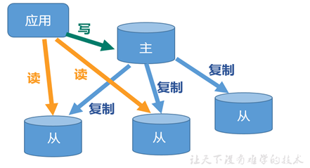
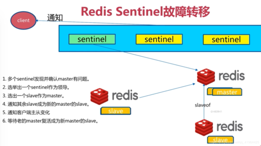
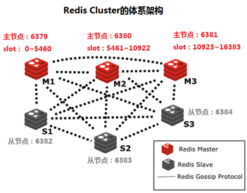

# Redis 高级配置

## 一 可能存在的问题

一般来说，要将 Redis 运用于在项目上，只是用一台 Redis 是万万不能的，原因如下：

1. 从结构上，单个 Redis 服务器会发生单点故障，并且一台服务器需要处理所有的请求负载，压力比较大。
2. 从容量上，单个Redis服务器内存容量有限，就算一个Redis服务器内容量为256G，也不会将所有的内存用作Redis存储内存，一般来说，单台Redis最大使用内存不应该超过20G。

**问题：** `内存容量有限、处理能力有限、无法高可用`


## 二 主从复制

### 简介

应用场景

> 电子商务网站上的商品，一般是一次上传，无数次浏览的，专业名词为“多读少写”

**主从复制**

一个 Redis 服务可以有多个该服务的复制品，这个 Redis 服务成为 Master，其他的复制品成为 Slaves。



**主从复制**

1. **读写分离**
2. **数据被复制了好多分**

### Redis 主从复制配置

#### 通用安装包redis

1. 主数据库不需要任务配置，创建一个从数据库

redis.conf 配置文件信息添加

```
-- port 6380
-- slaveof 127.0.0.1 6379
```

2. 启动从服务器

```
./bin/redis-server ./redisconf --port 6380 --saveof 127.0.0.1 6379
```

#### Docker 配置 Redis 主从复制

http://note.youdao.com/noteshare?id=7eeea47aaa338fb6625ec994257d73a9


### Redis 哨兵模式

解决 redis master主机出现宕机的可能 。

> 有了主从复制实现之后，我们如果想从服务器进行监控，那么在redis2.6以后提供了一个 哨兵 机制，并在 2.8 版本稳定下来。



**核心：心跳机制** 快慢不定

> 1.不时地监控redis 是够按照预期良好的运行
>
> 2.如果出现某个redis 节点运行出现状况，能够通知另外一个进程
>
> 3.能够进行自动切换，当一个master节点不可用时，能够选举出master的多个slave中的一个作为新的master，其他的slave节点追随新的master地址。

### Redis Cluster集群

为了在大流量的访问下提供服务。解决高可用、高并发

Redis 集群搭建有多种，但从redis3.0 之后**最少使用3个master和3个slave才能建立集群**

Redis Cluster 采用无中心结构，每一个节点保存数据和整个集群状态，每一个节点都和其他所有节点相连，



1. 所有的 redis 节点彼此环联，内部采用二进制协议优化传输速度和带宽
2. 节点的 fail 是通过集群中超过半数的节点检测失效才生效
3. 客户端和 redis 节点直连，不需要中间proxy层，客户端不需要连接集群的所有节点，连接集群中任意一个节点即可。
4. redis cluster 把所有的物理节点映射到（0-16383）slot 上。
5. Redis 集群预先分好 16384 个哈希槽，当需要在redis 集群中放置一个 key-value 时，redis先对key使用 crc16 算法算出一个结果，然后把结果对 16384 求余数，这样每个 key 都会对应一个编号在 0-16383 之间的哈希槽，redis会根据节点数量大致均等的将哈希槽映射到不同的节点中。